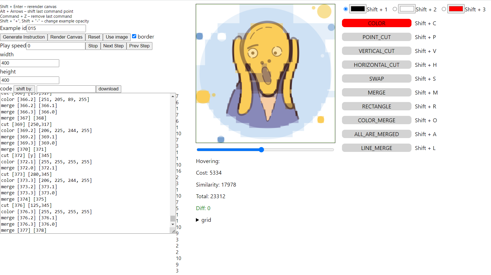

# ICFPC-2022 Pegovka team

## Main solver algorithm pipeline (for organizers)

1. Run rotator to iterate 8 different rotations and flips.
2. For each run Preprocessor to cut image to horizontal ribbons and swap them to put more complex ribbons to bottom.
3. Run GridBuilder to get a grid and then run GridGuidedPainter. (lib\Algorithms\GridGuidedPainterRunner.cs)
4. run Postprocessor to swap ribbons to their places.
5. run Enhancer for solution to microoptimize it.

## Pics

Visualizer:

GridBuilder:

